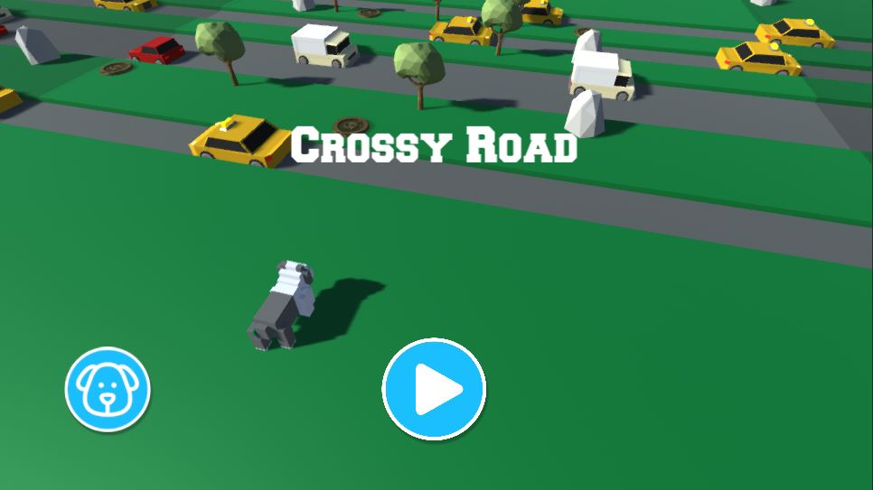

# Crossy Road Prototype
My pet project in Unity. The copy of the world famous game.

Link to WebGL building: https://play.unity.com/mg/other/webgl-builds-208581
Link to original: https://poki.by/g/crossy-road
## Screenshot
### Menu

____
### Gameplay

____
### Pause

____
### Skins

## Features
+ Unity Events
+ Skin system
+ (SOLID)
+ Data Persistence (Best Score, Coins)
+ 
